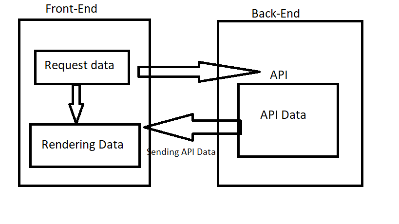

Netlify Link : https://gracious-dubinsky-b0fc26.netlify.app/ 

# City Explorer

**Author**: Mohammad Aljadayh 
**Version**: 1.0.0

## Overview

This website allows users to explore any location and display name of it with lat and long 

## Getting Started
- Create React App in new project 
- install needed requrements ( axios,bootstrap)
- add location Api to the project . 

## Architecture

using 
- react 
- axios
- API.
- Bootstrap. 

## Change Log

## Credit and Collaborations

[ Axios](https://axios-http.com/docs/api_intro)

[ locationiq](https://locationiq.com/)

## 
 
Name of feature: create starter code for react app and connect it with a repo also add url for netlify  

Estimate of time needed to complete: 30 min

Start time: 1:50 pm

Finish time: 2:20pm

Actual time needed to complete: 30 min

------------------------------------------------------ 

Name of feature: Add Request to API server

Estimate of time needed to complete: 30 min

Start time:2:20pm . 

Finish time: 3:20pm . 

Actual time needed to complete: 1 Hour to understand it. 

----------------------------------------------------------------------------

Name of feature:  writing  the rest of requrment in terlo  

Estimate of time needed to complete: 2 Hours. 

Start time:8 pm

Finish time: 11 pm

Actual time needed to complete: 40 min

REACT_APP_LOCATION_IQ_KEY=pk.1e3241be7d1698a9e8dc92c3d512e09f
REACT_APP_SERVER_URL=http://localhost:3081